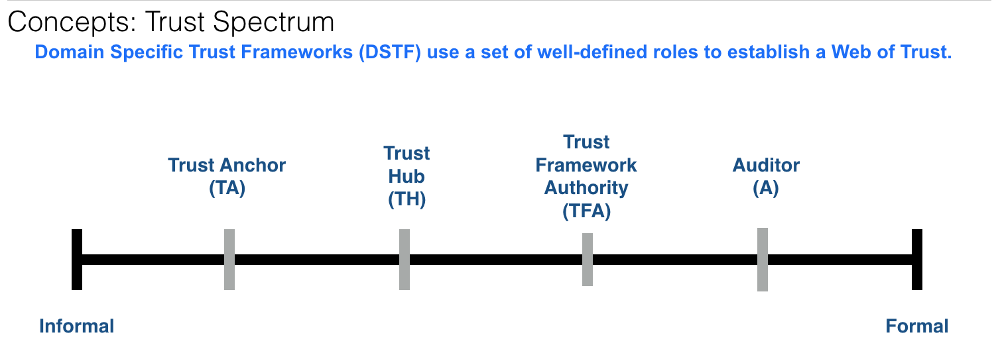
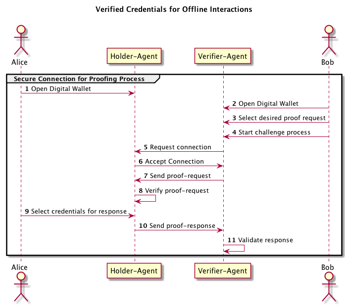

# Verifiable Credentials for Offline Interactions

## Disclaimer
This discussion is being initiated during a period, namely Summer 2018, whereby the Sovrin Trust Framework (STFv2) is still in draft status.

While offline interaction scenarios are real and there is a understanding that this problem domain may possibly be an inhibitor for SSI/VC adoption by key stakeholders like DMVs, the solution concepts presented herein need to be matured inline with the roadmap for the Sovrin Trust Framework (Versions 2 and 3). It is anticipated that the proposal outlined herein would be targeted for STFv3.

## Abstract
[Hyperledger Indy](https://www.hyperledger.org/projects) ("Indy") provides an implementation of Verifiable Credentials using Zero Knowledge Proofs ("ZKP") whereby there is an assumption that both the holder and the verifier are both online (connected to the internet). This paper proposes an approach for how Indy can be used under situation where the stakeholders are offline.

## Authors

* Jan Camenisch
* Manu Drijvers
* Maria Dubovitskaya
* Dan Gisolfi

## Background

The Sovrin Community, which leverages Indy, uses [Camenisch-Lysyanskaya (CL)](http://groups.csail.mit.edu/cis/pubs/lysyanskaya/cl02b.pdf)  signatures which are zero-knowledge proof signatures. When using CL signatures, the holder of a credential can prove a wide variety of facts about the credential, including individual attribute values, without revealing the actual data, and with just one encoding of the credential and signature.

CL signatures are generated using a blinded “link secret” that allows the holder to create a proof across any set claims in any set of credentials issued using the same link secret. For example, a verifier may request proof that specific identity traits (attributes) were issued to an individual (the holder) without revealing information about the holder -issuer relationship.

Additionally, the concepts being proposed for the STFv2 includes a set of roles associated with a spectrum of trust for domain specific trust frameworks. This proposal assumes that a *Trust Framework Authority (TFA)* is an entity that is defined by a Domain Specific Trust Framework (DSTF). A TFA has many responsibilities, one of which includes the issuance of a “Certified Issuer Credential” as the TFA is a root of trust in a DSTF for Issuers.

## Purpose
Indy, as of v1.6.1, does not support the a ZKP approach for responding to proof-requests under the following conditions:

1. Offline peers, and the Verifier requires revealed data
2. Offline peers, and the Verifier will accept blinded data

This intent of this paper is to provide a proposal to the Indy project for how offline verification of identity proof-responses can be achieved.

## Real World Applicability
Situations whereby identity proof challenges may occur without the availability of a broadband connection are very real. Consider  a few examples:

* Traffic stop by a Police Officer in a remote area.
* Fishing/Game Warden proofing a sportsman in a remote area.
* Emergency Response Professional presenting credentials to Situation Officials for access and participation.

## User Story
Alice, a trooper for the State of Arizona, patrols the rural [Interstate 15](https://en.wikipedia.org/wiki/Interstate_15_in_Arizona) highway during night shifts and is often presented with the precarious task of challenging truckers and motorists during routine traffic stops. Bob is a trucker that uses I-15 as a common bypass between Nevada and Utah. After a long days journey, Bob caught himself dozing at the wheel. Unfortunately, Alice also observed him dangerously swerving so she pulled him over. While Alice runs a license plate scans from here patrol car, she has no way of knowing who is actually the operator of the truck and whether that person is authorized to be the operator. Using her loud speak she request the driver to place his smartphone in discovery mode and prepare to accept and identity challenge. Using her digital verifier on her smartphone she sends a proof-request for multiple credentials, namely drivers license, auto insurance and vehicle registration. Alice's request is a standard AZ defined proof request that requires all attributes of all credentials to be revealed. Bob, now very alert and upset with himself, opens his digital wallet to accept the challenge. Since he carries multiple credentials (personal and professional), he must respond with his commercial driver's license (CDL), the insurance and vehicle registration credentials for the truck as provided by his employer. Alice receives Bob's response and is able to verify that the claims in each credential was signed by the issuer of the credential. Alice then proceed's to confront Bob knowing a fair amount of details about him including what he looks.        

## Requirements

1. The solution SHOULD enable [Safely Vetting a Drivers License](https://www.ibm.com/blogs/blockchain/2016/06/safely-vetting-a-digital-drivers-license/)
2. Verifier and Holder MUST be able to connect without establishing a broadband connection.
3. Verifier MUST be able to request a mix of revealed and unrevealed attributes across a range of credentials from multiple issuers.
4. Holder MUST be able to selectively disclose information. While, an auto insurance card may be required, he MUST be able to select which one on his wallet he desires to use.
5. Verifier MUST be able to address these concerns without the aid of external services:
  * All presented claims are verified to be signed by the issuer of origin
  * All presented claims are valid, not expired.
6. Verifier MUST be able to ascertain when the last time the Holder was online. Feedback from Law Enforcement is that anything >24hrs is a red-flag.
7. The Verifier MUST not be required to have knowledge or a relationship with the Issuer of a credential used in proof-response.

## Applicability of ZKPs
We assume that with adequate changes to the Verifiable Credential Schema along with changes to Indy for support of hierarchical trust and the caching of roots of trust by the Verifier, a solution can be implemented without dramatic changes to the existing ZKP flow of Indy.

## Discussion Topics

### Presentment of Proofs
A solution to this problem MUST allow the Holder's Agent to perform the following tasks:

* Holder selects one or more identity traits (attributes) from one or more credentials from his/her digital wallet.
* For each unique credential that will be included in the proof-response:

  1. Generate a ZKP that the each selected attribute is contained in the issued credential that is held by the Holder.
  2. Send the above ZKP along with:
    * Public Key of Issuer of the Credential
    * Issuer's *Certified Issuer Credential* from the TFA

### Open Questions
* Can Verifiable Credential support combined credential Proofs? [See proposal and discussion here](https://docs.google.com/document/d/10e6lcsX0kiXkWX4_79hD1fb4p_AbFGsRm90eJJKFayI/edit?ts=5b697a4b#heading=h.5n2rgn5i7d3g) as well as the [Pull Request](https://github.com/sovrin-foundation/vc-data-model/tree/anoncred).
* Can Indy support hierarchical proofs within ZKP processing? This implies recursive verification of Issuer Certification Chain (list of trusted certifiers backing the Issuer).
* How does Verifier's proof-response verification process change for the inclusion of the known Trusted Root Authorities.

## Solution Description
TBD
